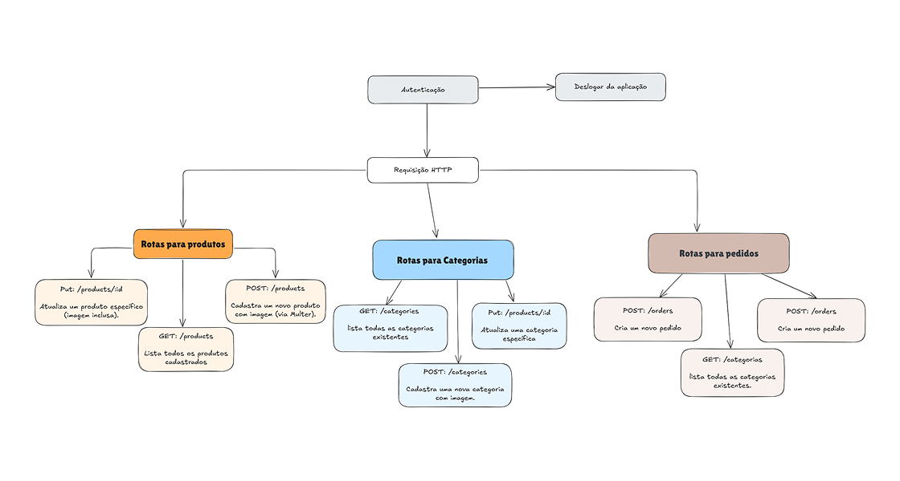

# DevBurger API

A **DevBurger API** é uma aplicação backend para gerenciar uma hamburgueria online. Ela oferece funcionalidades como cadastro de usuários, autenticação, gerenciamento de produtos, categorias e pedidos. Essa API foi construída utilizando **Node.js** e outras tecnologias modernas.

> **Nota**: Essa api foi desenvolvida com o objetivo de ser utilizado com o frontend **DevBurger Interface**.

## Índice

- [Descrição](#descrição)
- [Tecnologias Utilizadas](#tecnologias-utilizadas)
- [Pré-requisitos](#pré-requisitos)
- [Instalação](#instalação)
- [Configuração](#configuração)
- [Rotas Disponíveis](#rotas-disponíveis)

## Descrição

A API é projetada para ser a base de um sistema de e-commerce para hamburguerias. Com ela, é possível:

- Gerenciar usuários e autenticação;
- Cadastrar, listar e atualizar produtos e categorias;
- Criar, listar e gerenciar pedidos.

## Tecnologias Utilizadas

As principais tecnologias utilizadas no projeto incluem:

- **Node.js**: Plataforma de desenvolvimento JavaScript.
- **Express**: Framework para construção de APIs.
- **Sequelize**: ORM para bancos de dados relacionais.
- **PostgreSQL**: Banco de dados utilizado no projeto.
- **Multer**: Middleware para upload de arquivos.
- **JWT (JSON Web Token)**: Gerenciamento de autenticação.
- **Yup**: Validação de dados do lado do servidor.

## Pré-requisitos

Certifique-se de ter as seguintes ferramentas instaladas em seu sistema:

- [Node.js](https://nodejs.org/)
- [PostgreSQL](https://www.postgresql.org/)
- [npm](https://www.npmjs.com/) ou [yarn](https://yarnpkg.com/)

## Instalação

1. Clone o repositório:

   ```bash
   git clone https://github.com/Allysson-ryan/devburger-api.git
   ```

2. Acesse o diretório do projeto:

   ```bash
   cd devburger-api
   ```

3. Instale as dependências:

   ```bash
   npm install
   ```

4. Configure as variáveis de ambiente seguindo a [seção de configuração](#configuração).

5. Inicie o servidor em modo de desenvolvimento:
   ```bash
   npm run dev
   ```

## Configuração

Crie um arquivo `.env` na raiz do projeto e adicione as seguintes variáveis:

```env
DB_HOST=<endereço_do_banco_de_dados>
DB_USER=<usuário_do_banco_de_dados>
DB_PASS=<senha_do_banco_de_dados>
DB_NAME=<nome_do_banco_de_dados>
JWT_SECRET=<segredo_para_jwt>
PORT=3333
```

Certifique-se de substituir os valores pelos dados corretos para o seu ambiente.

## Rotas Disponíveis

### Usuários

- **`POST /users`**: Criação de um novo usuário.
- **`POST /session`**: Autenticação de usuário e criação de sessão (JWT).

### Produtos (Requer autenticação)

- **`POST /products`**: Cadastro de produtos com upload de imagem.
- **`GET /products`**: Listagem de todos os produtos.
- **`PUT /products/:id`**: Atualização de um produto existente (com upload de imagem).

### Categorias (Requer autenticação)

- **`POST /categories`**: Cadastro de novas categorias com upload de imagem.
- **`GET /categories`**: Listagem de todas as categorias.
- **`PUT /categories/:id`**: Atualização de uma categoria.

### Pedidos (Requer autenticação)

- **`POST /orders`**: Criação de novos pedidos.
- **`GET /orders`**: Listagem de todos os pedidos.
- **`PUT /orders/:id`**: Atualização do status de um pedido.

Desenvolvido por [Allysson Ryan](https://github.com/Allysson-ryan).


## 📫 Screenshot do fluxograma da Api


